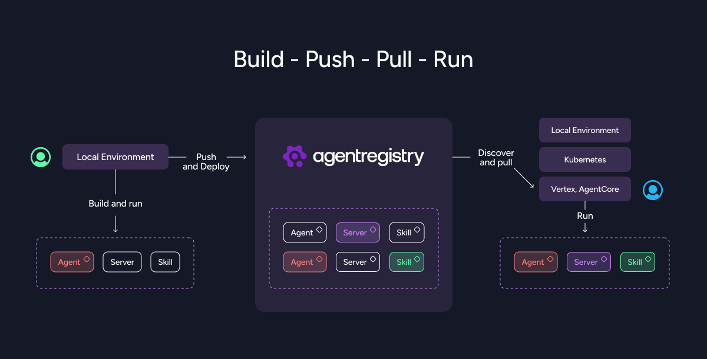
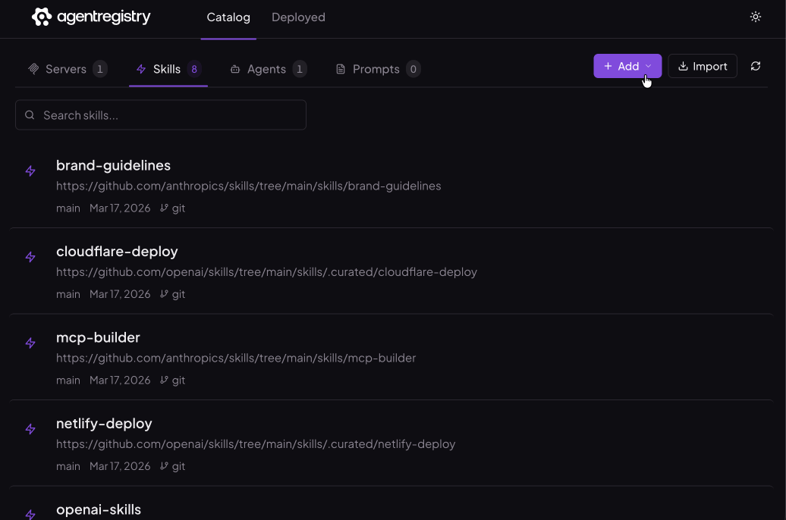
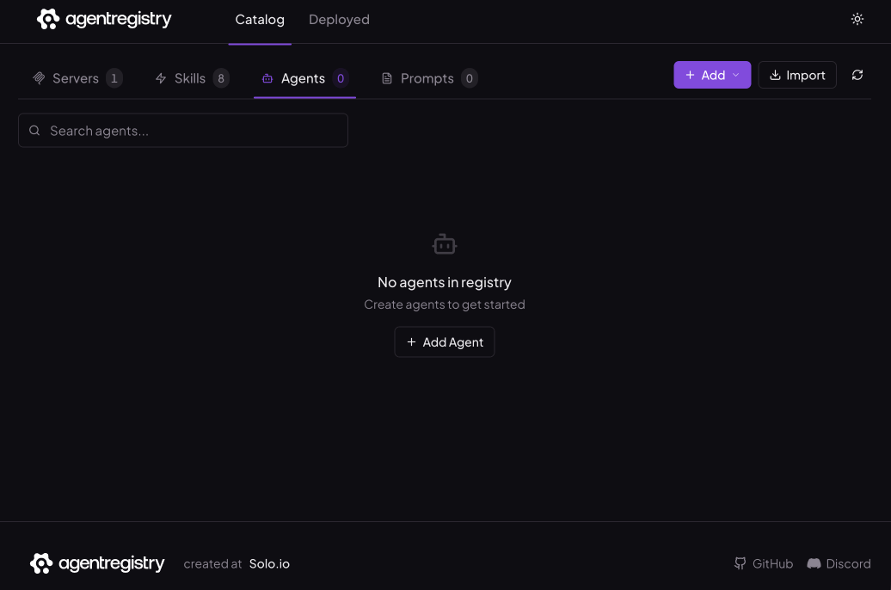
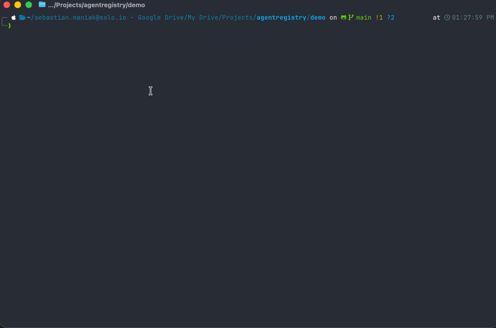

<p align="center">
  
</p>

<h1 align="center" style="font-size: 3em;">Build. Deploy. Discover.</h1>
<h3 align="center">One registry for MCP servers, agents, and skills.</h3>

<br/>

<p align="center">
  <a href="https://github.com/agentregistry-dev/agentregistry/stargazers"></a>
  &nbsp;
  <a href="https://discord.gg/HTYNjF2y2t"></a>
  &nbsp;
  <a href="https://github.com/agentregistry-dev/agentregistry/releases"></a>
  &nbsp;
  <a href="LICENSE"></a>
  &nbsp;
  <a href="https://golang.org/doc/install"></a>
</p>

<p align="center">
  <a href="https://aregistry.ai">Website</a> · <a href="https://aregistry.ai/docs/">Docs</a> · <a href="https://discord.gg/HTYNjF2y2t">Discord</a> · <a href="https://github.com/agentregistry-dev/agentregistry">GitHub</a> · <a href="#quick-start">Quick Start</a>
</p>

---

## What is agentregistry?

agentregistry is an open-source platform that gives you one place to find, manage, and run MCP servers, AI agents, and skills.

Right now, the MCP servers and AI tools your team needs are spread across npm, PyPI, Docker Hub, GitHub repos, and random URLs. Nobody knows which ones are trustworthy, which versions work, or how to get them running. Every developer is doing their own manual Docker setup and IDE configuration.

agentregistry puts all of that into a single registry with a CLI and a web UI. You import or publish artifacts once, and then anyone on your team can discover them, deploy them with one command, and have their IDE automatically configured to use them.

Build, test, publish, and deploy AI artifacts with minimal dependencies.

<table>
<tr>
<td width="400">
  
  <br/>
  <em>Create, Add artifacts, Test, Publish, Deploy, Consume</em>
</td>
<td>

- **Local development** — Create and test agents, skills, and MCP servers locally.
- **Easy publishing** — Publish your artifacts to a registry with a single command.
- **Pull and run anywhere** — Pull artifacts from the registry and run them in any environment instantly — local Docker, Kubernetes, or any cloud.
- **Discover and consume** — Find new artifacts to add to your registry or optimize existing ones. Consume directly from Claude Code, Cursor, VS Code, Claude Desktop, OpenCode, or any MCP-compatible client.

</td>
</tr>
</table>

---

## Why agentregistry?

- **Centralized control** — Package and collect AI artifacts from any source into a single registry.
- **Security and governance** — Curate and approve agents, servers, and skills before company-wide deployment.
- **Enriched metadata** — Add context to help assess trustworthiness and security.

<p align="center">
  
</p>

---

## Web UI

A browser-based admin interface at `localhost:12121`. Add MCP servers, skills, and agents through a visual interface. Browse the artifact catalog, review enrichment scores and metadata, manage deployments, and configure the registry — all without touching the CLI.

<p align="center">
  
</p>

---

## Core Capabilities

### Artifact registry

A centralized catalog for three types of AI artifacts, backed by PostgreSQL with pgvector for semantic search.

<table>
<tr>
<td width="52%" valign="top">
<p><strong>MCP servers</strong> — The tools that AI agents and IDE assistants call at runtime. agentregistry supports every packaging model: npm packages run via <code>npx</code> on <code>node:24-alpine</code>, PyPI packages run via <code>uvx</code> on Astral's <code>uv</code> runtime, OCI/Docker images pulled from any container registry, and remote HTTP/SSE endpoints accessed directly with optional auth headers. Each server entry stores rich metadata including version history, tool listings, environment variable requirements, package references, and automated quality scores.</p>
</td>
<td width="48%" align="center" valign="top">
  
  <br/>
  <em>Create and register MCP servers from npm, PyPI, Docker, or remote endpoints</em>
</td>
</tr>
</table>

<table>
<tr>
<td width="52%" valign="top">
<p><strong>Skills</strong> — Structured knowledge packages that extend what an agent knows beyond its base training. A skill is a SKILL.md instruction file bundled with optional code examples, documentation, PDFs, and reference URLs. Skills are published as container images to Docker Hub or any OCI-compatible registry and can be pulled locally by any compatible AI assistant. The <code>arctl skill init</code> command scaffolds the directory structure; <code>arctl skill publish</code> builds and pushes the image.</p>
</td>
<td width="48%" align="center" valign="top">
  
  <br/>
  <em>Scaffold, build, and publish skills as portable container images</em>
</td>
</tr>
</table>

<table>
<tr>
<td width="52%" valign="top">
<p><strong>Agents</strong> — Definitions that bundle an agent's identity with its dependencies: which MCP servers it needs, which skills it uses, and how it should be configured. agentregistry uses the ADK (Agent Development Kit) scaffolding pattern. Blueprints package an agent and all its dependencies into a single versioned artifact for one-step deployment.</p>
</td>
<td width="48%" align="center" valign="top">
  
  <br/>
  <em>Define agents with bundled MCP servers, skills, and configuration</em>
</td>
</tr>
</table>

**Prompts** — Reusable instruction templates that define how an agent should behave in specific contexts. Prompts are versioned and stored in the registry alongside agents, skills, and servers, making them discoverable and shareable across your team.

### Build and push

<table>
<tr>
<td width="52%" valign="top">
<p>Scaffold agents using ADK, version them, and push to the registry. Blueprints bundle an agent definition with its MCP server dependencies and skills into a single deployable unit. The registry stores the metadata and pointers — actual container images live in Docker Hub, GHCR, or any OCI registry you use. This means you own your artifacts; agentregistry indexes and governs them.</p>
</td>
<td width="48%" align="center" valign="top">
  
  <br/>
  <em>Add MCP servers and skills to agents, then push to the registry</em>
</td>
</tr>
</table>

### Deploy anywhere

Deploy the same artifact to Docker locally or to any Kubernetes cluster from a single UI or CLI — no code changes required. When you deploy an MCP server, agentregistry runs a three-stage translation pipeline:

1. **Registry translator** — Reads the server definition, determines local vs. remote deployment, and selects the base Docker image based on package type (npm, PyPI, OCI).
2. **Compose translator** — Generates a Docker Compose configuration with the correct image, command, ports, environment variables, and Agent Gateway routing rules.
3. **Reconciler** — Writes `docker-compose.yaml` and `agent-gateway.yaml` to `~/.agentregistry/runtime/` and runs `docker compose up` to match desired state. Fully idempotent — run it as many times as you want.

The Agent Gateway acts as a reverse proxy that provides a single MCP endpoint for all deployed servers. AI clients connect to one URL; the gateway routes each tool call to the correct backend. Deploy a new server later and every connected IDE picks it up automatically — no reconfiguration needed.

### Semantic search

Natural language search across agents, tools, and MCP servers — for humans and for agents discovering capabilities at runtime. Powered by pgvector, the registry indexes artifact metadata as embeddings so you can search by description ("find me a server that queries Postgres") instead of exact names. This works in the Web UI, through the CLI, and through the REST API — meaning agents themselves can discover and select tools programmatically.

### Governance and control

agentregistry automatically enriches every artifact on ingest. Operators get:

- **Audit visibility** — Full view of what's registered, what's deployed, and what's in use across your organization.

### Kubernetes-native deployment

**Prerequisites:** Docker Desktop with Docker Compose v2+

```bash
# 1. Install the CLI
curl -fsSL https://raw.githubusercontent.com/agentregistry-dev/agentregistry/main/scripts/get-arctl | bash

# 2. List available MCP servers (starts the registry daemon automatically)
arctl mcp list

# 3. Open the web UI
open http://localhost:12121

# 4. Deploy a server and configure your IDE
arctl deploy <server-name>
arctl configure cursor
```

That's it. Your IDE now has access to the deployed server through the Agent Gateway.

---

## Related Projects

| Project | Role |
|---|---|
| [Agent Gateway](https://github.com/agentgateway/agentgateway) | AI-native reverse proxy for MCP traffic |
| [kagent](https://github.com/kagent-dev/kagent) | Kubernetes-native AI agent platform |
| [kgateway](https://github.com/kgateway-dev/kgateway) | Cloud-native API gateway (Envoy + Gateway API) |
| [MCP Go SDK](https://github.com/modelcontextprotocol/go-sdk) | Go SDK for building MCP servers |
| [Model Context Protocol](https://modelcontextprotocol.io/) | The open standard for AI-to-tool communication |

---

## Community

### Communication channels

If you're interested in participating with the agentregistry community, come talk to us!

- We are available on [**Discord**](https://discord.gg/HTYNjF2y2t)
- To report security issues, please follow our [**vulnerability disclosure best practices**](https://github.com/agentregistry-dev/agentregistry/security)
- Find more information on the [**agentregistry website**](https://aregistry.ai)

### Community meetings

We do not yet have community meetings. [**Establishing these meetings**](https://github.com/agentregistry-dev/agentregistry/issues) is on our [**roadmap**](https://github.com/agentregistry-dev/agentregistry/issues). Please help us deliver this work by either commenting on the issue, or volunteering to establish the meetings.

### Contributing

See [`CONTRIBUTING.md`](CONTRIBUTING.md) for guidelines and [`DEVELOPMENT.md`](DEVELOPMENT.md) for architecture and local development setup.

[Report a bug](https://github.com/agentregistry-dev/agentregistry/issues) · [Suggest a feature](https://github.com/agentregistry-dev/agentregistry/discussions) · [Join Discord](https://discord.gg/HTYNjF2y2t)

## License

Apache 2.0 — see [`LICENSE`](LICENSE).
