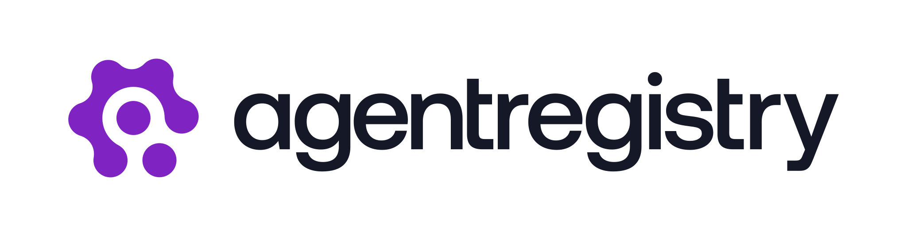
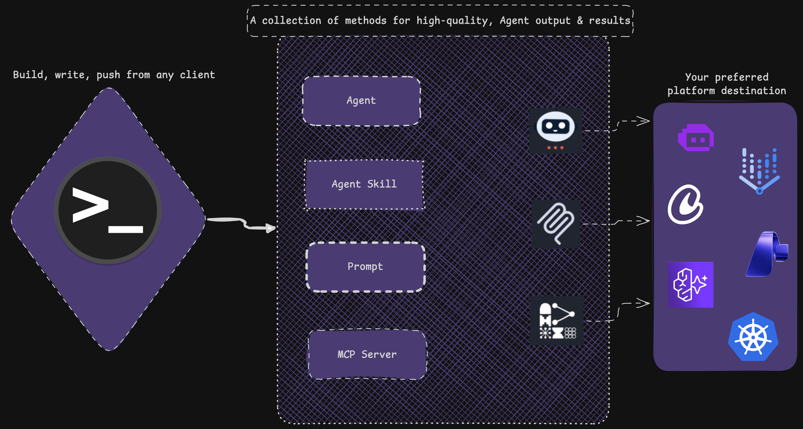

<div align="center">
  <picture>
    
  </picture>

  [![Go Version][go-img]][go] [![License][license-img]][license] [![Discord][discord-img]][discord]

  ### The trusted catalog and delivery path for MCP servers, agents, and skills.

  ---
</div>

Agent Registry gives platform teams and developers one place to manage the agentic infrastructure their applications depend on.

Use the web UI and `arctl` CLI to publish approved MCP servers, agents, and skills, discover what is available, and make those artifacts usable across local development, shared environments, and Kubernetes.

---

## 🤔 Why Agent Registry?

- 📦 **One trusted source for AI building blocks** — a curated catalog instead of scattered repos, scripts, and one-off MCP setup.
- 🚀 **Faster developer onboarding** — discover approved artifacts quickly with less manual configuration.
- 🌐 **Consistent path from laptop to cluster** — same discovery and delivery workflow across local dev and Kubernetes.
- 🔒 **Governance without slowing teams down** — centralize curation and publishing without forcing each team to rebuild the process.

<p align="center">
  
</p>

## 🔗 Quick Links

- 📥 [Install `arctl`](https://github.com/agentregistry-dev/agentregistry/releases)
- 🚀 Quickstart guides:
  - [Local development](https://aregistry.ai/docs/agents/deploy/local/)
  - [Kubernetes](https://aregistry.ai/docs/agents/deploy/kubernetes/)
- 🎬 [See it in action](https://www.youtube.com/watch?v=l6QicyGg46A)
- 📖 [Development details](DEVELOPMENT.md)
- 🤝 [Contributing](CONTRIBUTING.md)
- 💬 [Discord](https://discord.gg/HTYNjF2y2t)

---

## 📚 Core Capabilities

### 📦 Registry

Curate a shared catalog of MCP servers, agents, and skills your teams can trust and reuse.

- Publish artifacts from a central registry
- Discover approved artifacts with the CLI and web UI
- Give teams a consistent source of truth across environments

### 🔒 Curation and Governance

Turn a broad set of available AI artifacts into a collection your organization is willing to support.

- Organize what developers can discover and deploy
- Standardize how artifacts are shared across teams
- Keep control of what gets published and promoted

### 🚀 Deployment Workflows

Move from discovery to usage without reinventing the same delivery path for every team.

- Run workflows locally with `arctl`
- Deploy Agent Registry into Kubernetes with Helm
- Support local environments and shared platform environments from the same registry

### 🌐 Client and Gateway Integration

Make approved artifacts easier to consume from the tools developers already use.

- Generate configuration for Claude Desktop, Cursor, and VS Code
- Pair with Agent Gateway for a consistent access layer to deployed MCP infrastructure
- Reduce manual setup for AI clients and shared environments


### 🔧 How It Works Together

1. **Platform teams** curate and publish approved MCP servers, agents, and skills in Agent Registry.
2. **Developers** discover those artifacts through the web UI or `arctl`.
3. **Teams** pull and deploy what they need in local environments or Kubernetes.
4. **AI clients** and shared gateway infrastructure connect to approved artifacts through a consistent workflow.

---

## 🏗️ Flexible Deployment

### 💻 Local Development

Get started with a local registry in minutes. The first time `arctl` runs, it automatically starts the local registry daemon and imports the built-in seed data.

```bash
# Install via script
curl -fsSL https://raw.githubusercontent.com/agentregistry-dev/agentregistry/main/scripts/get-arctl | bash

# Discover available MCP servers
arctl mcp list

# Configure supported AI clients
arctl configure claude-desktop
arctl configure cursor
arctl configure vscode
arctl configure claude-code
```

Open `http://localhost:12121` to use the web UI.

### ☸️ Kubernetes

Run Agent Registry in a cluster when you want shared discovery and deployment workflows. An external PostgreSQL instance with the [pgvector](https://github.com/pgvector/pgvector) extension is required.

#### PostgreSQL

Deploy a single-instance PostgreSQL and pgvector into your cluster using the provided example manifest:

```bash
kubectl apply -f https://raw.githubusercontent.com/agentregistry-dev/agentregistry/main/examples/postgres-pgvector.yaml
kubectl -n agentregistry wait --for=condition=ready pod -l app=postgres-pgvector --timeout=120s
```

This setup is intended for development and testing. For production, use a managed PostgreSQL service or a production-grade operator.

#### Install Agent Registry

```bash
helm install agentregistry oci://ghcr.io/agentregistry-dev/agentregistry/charts/agentregistry \
  --namespace agentregistry \
  --create-namespace \
  --set database.host=postgres-pgvector.agentregistry.svc.cluster.local \
  --set database.password=agentregistry \
  --set database.sslMode=disable \
  --set config.jwtPrivateKey=$(openssl rand -hex 32)
```

Then port-forward to access the UI:

```bash
kubectl port-forward -n agentregistry svc/agentregistry 12121:12121
```

**Get started:** [Helm chart details](charts/agentregistry/README.md.gotmpl), [Local Kind cluster](scripts/kind/README.md)

---

## 🎬 See It In Action

Learn how to create an Anthropic Skill, publish it to Agent Registry, and use it in Claude Code.

[](https://www.youtube.com/watch?v=l6QicyGg46A)

---

## 🤝 Contributing

We welcome contributions and feedback from the community!

- 🐛 [Report issues](https://github.com/agentregistry-dev/agentregistry/issues)
- 💡 [Start a discussion](https://github.com/agentregistry-dev/agentregistry/discussions)
- 🔧 [Contributing guide](CONTRIBUTING.md)
- 📖 [Development details](DEVELOPMENT.md)
- 💬 [Join our Discord](https://discord.gg/HTYNjF2y2t)

---

## 📄 License

Apache V2 License. See [LICENSE](LICENSE) for details.

<!-- Badge links -->
[go-img]: https://img.shields.io/badge/Go-1.25%2B-blue.svg
[go]: https://golang.org/doc/install
[license-img]: https://img.shields.io/badge/License-Apache%202.0-green.svg
[license]: LICENSE
[discord-img]: https://img.shields.io/discord/1435836734666707190?label=Join%20Discord&logo=discord&logoColor=white&color=5865F2
[discord]: https://discord.gg/HTYNjF2y2t
