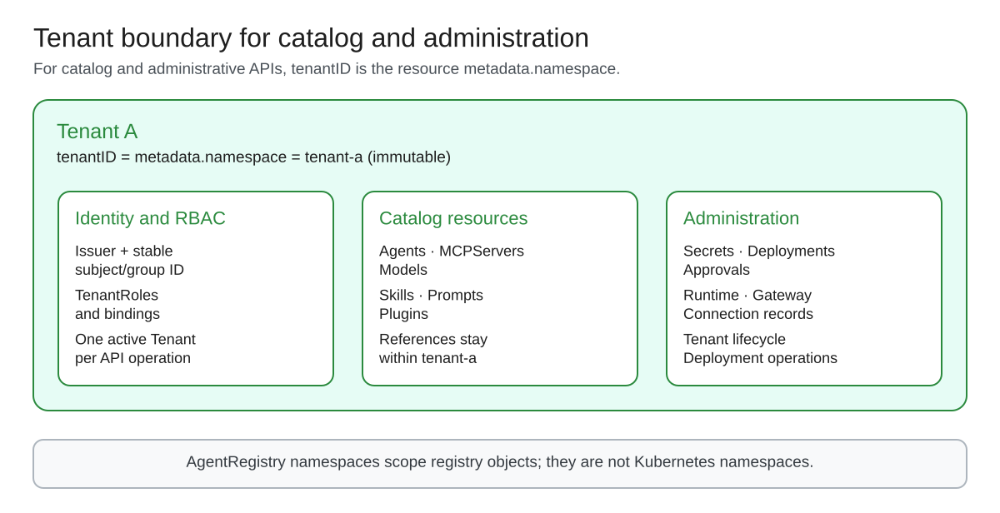
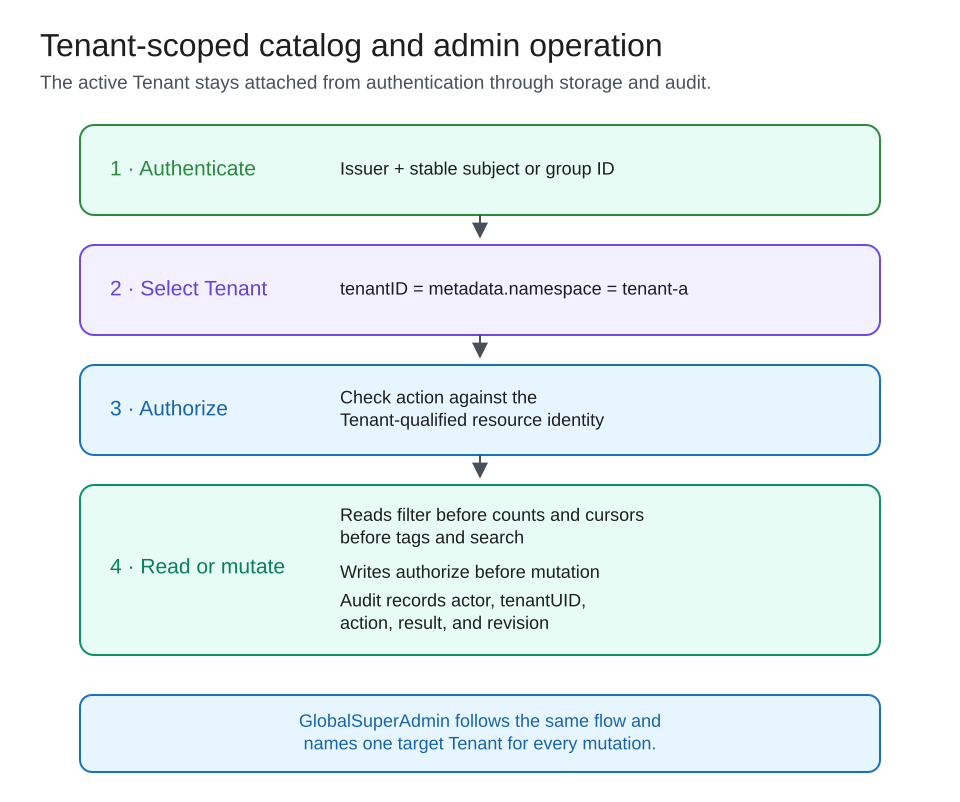

# ARE tenant-scoped catalog and administrative RBAC

**Status:** Proposal for architecture review. The model described here is not implemented.

**Sources:** [agentregistry-enterprise#1168](https://github.com/solo-io/agentregistry-enterprise/issues/1168) and the fine-grained authorization requirements in [#1139](https://github.com/solo-io/agentregistry-enterprise/issues/1139).

**Code baselines reviewed on 2026-08-31:**

- AgentRegistry OSS: deb4f2acd234bf2c1c852898e9d4197179cc0479
- AgentRegistry Enterprise: 556be4c98ff48dc09ec868536b8538ec5206e423

## Decision

Issue #1168 will define Tenant isolation for the AgentRegistry catalog and its administrative APIs.

One Tenant owns exactly one AgentRegistry namespace in v1. An ordinary principal can act only on resources in its active Tenant's namespace. Cross-Tenant sharing, imports, and foreign references are deferred.

RBAC v2 will replace AccessPolicy for catalog and administrative authorization. Existing data-plane authorization remains unchanged. RuntimeAccessPolicy stays a separate typed policy, and #1168 does not change agent or MCP invocation, gateway enforcement, usage attribution, or trace visibility.

Reviewers are asked to approve or challenge five decisions:

1. One Tenant uses one AgentRegistry namespace in v1.
2. Every ordinary catalog and administrative operation stays inside one active Tenant.
3. Namespace-qualified authorization and filtering run before any resource data or counts are exposed.
4. GlobalSuperAdmin selects an explicit target Tenant; global administration does not create a cross-Tenant resource relationship.
5. AccessPolicy migration under #1168 ends at the catalog/control-plane boundary.

## 1. Scope

This document classifies operations by purpose, not transport. Catalog and administrative operations read or change declarative resources and desired state. Runtime or data-path operations process traffic through a running Agent, MCPServer, Runtime, or gateway. Either class may use HTTP or gRPC.

The proposal covers:

- Tenant identity, lifecycle, and membership.
- Tenant-scoped catalog discovery and CRUD.
- Administration of Agents, MCPServers, Models, Skills, Prompts, Plugins, Secrets, Runtimes, gateways, connections, Deployments, approvals, AccessPolicies, RuntimeAccessPolicies, and related configuration.
- TenantRole, TenantRoleBinding, GlobalRole, and GlobalRoleBinding.
- Fine-grained permissions on catalog and administrative resources.
- Same-Tenant reference admission and Secret-reference checks.
- GlobalSuperAdmin access.
- Catalog and administrative migration away from AccessPolicy.
- Audit records for these operations.

A deploy, undeploy, or cancel request is an administrative action in scope. Authorization of traffic to the resulting workload is outside this proposal.

### Deferred work

This proposal does not define:

- Cross-Tenant resource sharing, imports, grants, or references.
- Agent or MCPServer invocation authorization.
- MCP tool, resource, or prompt discovery and calls.
- RuntimeAccessPolicy schema, compilation, or runtime evaluation changes.
- Runtime evaluation of legacy AccessPolicy.
- agentgateway, kagent, remote-MCP, or BYO gateway enforcement.
- Tenant policy distribution to runtime enforcement points.
- Runtime usage attribution, chargeback, trace projection, or telemetry repair.
- Anonymous public catalog publication.
- Physical isolation through separate databases, collectors, clusters, or Kubernetes namespaces.
- Per-Tenant quotas.

RBAC v2 governs catalog visibility and CRUD of AccessPolicy and RuntimeAccessPolicy as declarative resources. AccessPolicy mutation remains GlobalSuperAdmin-only in the reserved default Tenant while runtime consumers exist; RuntimeAccessPolicy mutation follows the tenant roles below. RuntimeAccessPolicy continues to govern the runtime behavior it covers today. A follow-up can define any additional Tenant-aware data-path contract if product requirements call for one.

## 2. Why the current model must change

The following findings are code-verified at the refs above:

- Resource storage already uses namespace-qualified identity.
- The OSS authorization resource key contains kind and name without namespace.
- Enterprise AccessPolicy RuleResource also omits namespace.
- Legacy list filters reduce grants to resource names, which can collide across namespaces.
- Some secondary read paths do not use the expected list filter. The tag-list route is one known gap.
- Resource references accept an explicit namespace, and the shared resolver checks existence without enforcing Tenant ownership.
- RBAC_SUPERUSER_ROLE already provides a global administrative bypass.
- AccessPolicy supplies both catalog and data-plane consumers.

Because AccessPolicy supplies both catalog and data-plane consumers, #1168 replaces only the catalog and administrative consumers. Data-plane consumers may continue reading AccessPolicy until separate work replaces them, so #1168 cannot delete the API or claim complete legacy removal.

## 3. Tenant and namespace model

A Tenant is the product boundary for catalog ownership, administration, visibility, and audit inside one ARE installation.

### Invariants

- V1 uses tenantID as the metadata.namespace value rather than storing a second mapping: `tenant.tenantID == resource.metadata.namespace`.
- `all` is reserved for compatibility-route global reads and cannot be a tenantID.
- The installation bootstraps the reserved `default` Tenant for compatibility. It cannot be renamed, recreated, or deleted while omitted-namespace compatibility remains.
- Each Tenant has exactly one namespace, and each tenant-serving namespace belongs to exactly one Tenant.
- Resources in an unbound or orphan namespace fail closed to ordinary requests until migration creates the Tenant with the matching tenantID.
- tenantID is immutable and is never reused after deletion.
- tenantUID is server-assigned and never reused. Bindings, audit events, and persisted references retain it.
- Every tenant-owned resource belongs to that one AgentRegistry namespace.
- Runtime, gateway, cluster, cloud account, region, environment, and Kubernetes namespace do not create additional AgentRegistry namespaces.
- A reference either inherits the parent resource's namespace or names that same namespace explicitly.
- An explicit foreign namespace fails admission.
- A controller running with system credentials preserves the Tenant boundary. System context may perform storage work but cannot authorize a foreign reference.
- Changing metadata.namespace in place is forbidden. Any future copy or transfer workflow needs a separate design.
- A principal may belong to several Tenants but selects one active Tenant for each request.

Projects or environments may organize resources inside one Tenant. A division that needs independent administration and visibility should be another Tenant.

### Lifecycle and membership

Tenant lifecycle states are Provisioning, Active, Suspended, and Deleting:

- Provisioning permits only GlobalSuperAdmin setup and migration.
- Active permits authorized catalog and administrative operations.
- Suspended permits authorized reads and denies ordinary mutations. Its effect on running workloads is deferred with the data path.
- Deleting denies new bindings, references, resources, and deployment actions. Its read visibility and resource-disposition rules remain open.

GlobalSuperAdmin controls lifecycle changes. TenantAdmin may update tenant-local display metadata but cannot change Tenant identity, ownership, or lifecycle.

Active TenantRoleBindings define membership. Membership makes a Tenant available in the UI selector; the referenced role supplies permissions. OIDC group membership is evaluated on each authenticated request.

## 4. Authorization model

### Principals

RBAC v2 keys User, Group, and Workload principals by issuer and stable subject or group ID. Display names, email addresses, and unqualified group names are not authorization keys.

If the management API accepts an on-behalf-of token, authorization must preserve the actor workload and delegated user. The active Tenant must admit both, and the allowed operation is their permission intersection. Downstream token exchange and runtime propagation are outside #1168.

Every item authorization decision contains:

- the authenticated principal or actor/delegated pair;
- one active Tenant UID;
- one action;
- one resource identity in that Tenant.

For ordinary principals, the active Tenant UID and resource Tenant UID must match. GlobalSuperAdmin may choose any target Tenant, but each mutation still names exactly one Tenant.

A create decision uses the active Tenant UID, resource kind, normalized requested name, and any parent or subresource identity. Persistence replaces that provisional identity with the server-assigned resource UID. A list decision binds the principal, active Tenant UID, action, resource kind, and one coupled resource-selector predicate. That predicate filters rows before counts or other secondary operations.

### Resource identity

Existing mutable resources use a server-assigned resource UID. Tagged content uses a stable lineage UID for the logical resource and an immutable version UID for each content version.

Exact-version rules stay pinned. Tag rules follow the named tag within the same lineage. All-version rules follow the lineage. Delete and recreate produces a new lineage UID, so old roles, references, and cursors do not transfer to the replacement. A compatibility name selector resolves to the current lineage UID when admitted and does not follow delete and recreate.

Authorization and list planning keep each tuple coupled:

Tenant UID, resource kind, lineage or resource UID, version or tag selector, and optional subresource.

Implementations must not turn allowed Tenants, names, versions, or subresources into independent sets.

### Roles and bindings

RBAC v2 defines TenantRole, TenantRoleBinding, GlobalRole, and GlobalRoleBinding.

| Action family | GlobalSuperAdmin | TenantAdmin | TenantOperator | TenantViewer | TenantAuditor |
| --- | --- | --- | --- | --- | --- |
| tenant.read | All | Tenant | Tenant | Tenant | Tenant |
| tenant.create, tenant.suspend, tenant.delete | All | No | No | No | No |
| tenant.updateMetadata | All | Tenant | No | No | No |
| access.read | All | Tenant | No | No | Tenant |
| access.manageRole, access.manageBinding | All | Tenant, escalation-checked | No | No | No |
| catalog.read | All | Tenant | Tenant | Tenant | Tenant |
| catalog.create, catalog.update, catalog.delete | All | Tenant | Tenant | No | No |
| catalog.reference | All | Tenant | Tenant | No | No |
| policy.read on AccessPolicy and RuntimeAccessPolicy | All | Tenant | Tenant | Tenant | Tenant |
| policy.create, policy.update, policy.delete on RuntimeAccessPolicy | All | Tenant | No | No | No |
| legacyPolicy.create, legacyPolicy.update, legacyPolicy.delete on AccessPolicy | Default Tenant only | No | No | No | No |
| secret.readMetadata | All | Tenant | Tenant | No | Tenant |
| secret.use in tenant-local desired state | All | Tenant | Tenant | No | No |
| secret.write, secret.rotate, secret.delete | All | Tenant | No | No | No |
| infrastructure.read | All | Tenant | Tenant | Tenant | Tenant |
| infrastructure.use in tenant-local desired state | All | Tenant | Tenant | No | No |
| infrastructure.create, infrastructure.update, infrastructure.delete | All | Tenant | No | No | No |
| deployment.read | All | Tenant | Tenant | Tenant | Tenant |
| deployment.create, update, delete, deploy, undeploy, cancel | All | Tenant | Tenant | No | No |
| approval.read | All | Tenant | Own submissions | No | Tenant |
| approval.approve, approval.reject, approval.revoke | All | Tenant | No | No | No |
| audit.read | All | Tenant | No | No | Tenant |

Policy actions cover management of declarative policy objects. They do not grant runtime authority or change policy evaluation. While any runtime consumer still reads legacy AccessPolicy, only GlobalSuperAdmin may mutate it, only in the reserved default Tenant, and only for compatibility or migration. secret.use and infrastructure.use authorize references in tenant-local desired state.

TenantRole belongs to one Tenant and cannot name another Tenant. TenantRoleBinding binds issuer-qualified principals to a built-in or custom TenantRole. GlobalRoleBinding is cluster-scoped and is the only binding that may grant GlobalSuperAdmin.

One versioned action schema validates TenantRoles, reference edges, and control-plane authorization hooks. Custom TenantRoles use typed actions and resource selectors. Empty selectors and arbitrary CEL are invalid.

Role and binding mutations run an escalation check. The caller cannot grant an action or resource tuple it does not hold. Tenant roles cannot grant global access, Tenant lifecycle actions, or access to another Tenant.

During migration, RBAC_SUPERUSER_ROLE temporarily maps to GlobalSuperAdmin. CatalogLegacyDetached requires an issuer-qualified GlobalRoleBinding to replace it.

## 5. Request and reference enforcement

### Active Tenant

New tenant-aware routes carry one explicit active Tenant in the path or authenticated request envelope. The UI Tenant selector changes that value. The server does not infer it from the caller's first membership, a resource name, or an untrusted header.

Compatibility routes have no separate active-Tenant field. Their namespace sets the active Tenant; omission maps to the reserved default Tenant and emits a migration signal. namespace=all is a GlobalSuperAdmin read mode. Every mutation, including a superadmin mutation, names one target Tenant.

### Lists and item reads

An ordinary list or item request can address only the active Tenant's namespace. Authorization runs before count, sort, pagination, cursor creation, aggregation, autocomplete, tag listing, relationship expansion, and search ranking.

Cursors bind the active Tenant and authorization revision. A cursor cannot be replayed after switching Tenants or losing access.

Private routes return 401 before lookup when unauthenticated. Hidden Tenants and resources return 404. A forbidden mutation of a visible resource returns 403. namespace=all returns 403 for an ordinary principal.

Endpoint inventory and tests must cover Tenant and membership discovery, collection lists, item reads, tags, search, relationships, autocomplete, counts, approvals, status, audit queries, and any compatibility API. A new route cannot ship without an authorization classification.

The anonymous MCP Registry compatibility API remains off by default. Tenant-isolated mode keeps it disabled until a separate public-catalog design defines publication and collision-safe item identity.

### Audit

Each catalog and administrative decision records the actor, delegated user when present, target Tenant UID, action, resource identity or collection predicate, allow or deny result, reason code, authority revision, request ID, and timestamp. Audit queries apply Tenant authorization and filtering before counts, cursors, pagination, or aggregation.

### References and Secrets

Blank reference namespaces inherit the parent resource's Tenant. An explicit namespace must equal the parent namespace. GlobalSuperAdmin does not receive an exception for cross-Tenant composition.

A versioned edge schema assigns exact parent and target actions to each parent kind, field path, and target kind. Unknown edges fail admission. ARE checks an edge when it admits the parent and before a controller uses it in a catalog or administrative reconciliation.

Catalog references require read plus the typed reference or use action for the target. Secret values never enter management API responses, logs, or audit payloads. Secret delivery, storage, rotation, and cleanup inside running workloads remain outside #1168.

## 6. Catalog migration

AccessPolicy is frozen for new catalog and administrative semantics. Allowed work under #1168 is limited to security fixes, compatibility, inventory, migration reports, shadow decisions, and removal of catalog/admin consumers.

While any runtime consumer remains, AccessPolicy mutations are GlobalSuperAdmin-only and limited to the reserved default Tenant. New and non-default Tenants cannot create AccessPolicy objects.

The existing default Tenant follows:

CatalogLegacyEnforced → CatalogShadowV2 → CatalogCutoverReady → CatalogV2Enforced → CatalogLegacyDetached

A new or pre-existing non-default Tenant follows:

CatalogProvisioningV2 → CatalogV2Enforced

Legacy catalog authorization may serve only the reserved default Tenant. New and non-default Tenants deny ordinary catalog and administrative traffic until RBAC v2 is ready.

Shadow mode compares legacy and v2 catalog decisions while legacy remains authoritative. The migration report classifies every principal and rule as AutoMapped, NeedsInput, or Blocked. Ambiguous issuers, namespace-blind names, wildcards, and duplicate names require explicit operator input.

Cutover freezes RBAC inputs, records the approving principal and revision, and atomically changes the Tenant's catalog authority. Server authorization hooks, list planners, and reference admission enforce that revision. The UI carries the selected Tenant, and audit records the revision. After cutover, v2 alone decides catalog and administrative requests.

The default Tenant may return to its captured legacy catalog snapshot during a limited rollback window and only before a v2-only binding or decision has been relied upon. New and non-default Tenants can return only to CatalogProvisioningV2 or a prior v2 revision.

CatalogLegacyDetached means AccessPolicy has no live catalog or administrative consumer. API deletion remains blocked while existing runtime consumers depend on it.

## 7. Acceptance contract

The design is complete when:

- One Tenant uses one AgentRegistry namespace in v1 through `tenantID == metadata.namespace`.
- Every tenant-serving namespace belongs to one Tenant, and resources in an unbound namespace cannot serve ordinary requests.
- An ordinary principal cannot list, read, mutate, reference, deploy, or administer a resource in another Tenant.
- GlobalSuperAdmin selects an explicit target Tenant and cannot create a cross-Tenant reference.
- Issuer-qualified User, Group, and Workload identities are tested with at least two Tenants, duplicate resource names, and a principal belonging to both.
- Tenant, kind, resource identity, version, tag, and subresource remain one authorization tuple.
- Lists filter before counts, cursors, pagination, tags, relationships, autocomplete, and search.
- Create and list authorization use the provisional identity and Tenant-bound predicate defined above.
- Same-named resources in two Tenants cannot cross-match on any catalog or administrative path.
- Reference admission and reconciliation reject foreign namespaces, including under system context.
- Secret values do not appear in management API responses, logs, or audit payloads.
- TenantRole and TenantRoleBinding escalation checks prevent privilege expansion.
- New and non-default Tenants never use namespace-blind legacy catalog authorization.
- Catalog cutover and rollback change one persisted authority revision atomically.
- Audit records contain the actor, target Tenant, action, decision, reason, authority revision, and request identity.
- AccessPolicy mutation remains GlobalSuperAdmin-only in the default Tenant while runtime consumers remain.
- AccessPolicy has no live catalog/admin consumer at CatalogLegacyDetached.
- Tests distinguish catalog/admin isolation from deferred runtime behavior and make no data-plane isolation claim.

## 8. Open catalog decisions

Review can begin while owners resolve:

1. Whether Tenant deletion requires an empty Tenant, cascades resources, or schedules a separate export and purge workflow.
2. Which principals may read a Tenant and its remaining resources while it is Deleting.
3. How long omitted-namespace compatibility for the default Tenant remains supported.
4. Whether anonymous public catalog publication returns in a separate design or remains disabled for tenant-isolated mode.

## 9. Deferred runtime boundary

Any future claim of Tenant isolation for runtime traffic requires a separate proposal. #1168 does not schedule that work. Such a proposal would first determine whether RuntimeAccessPolicy already supplies the required contract or whether A2A, MCP discovery and calls, agentgateway, kagent, remote-MCP, and BYO paths need additional Tenant identity and enforcement.

Usage attribution and trace projection belong with that runtime contract because their trusted Tenant identity comes from the invocation, Runtime, gateway, or ingestion boundary.

Cross-Tenant catalog sharing remains separate from the runtime deferral. If product later requires shared catalog resources, it needs its own threat model and API proposal.
